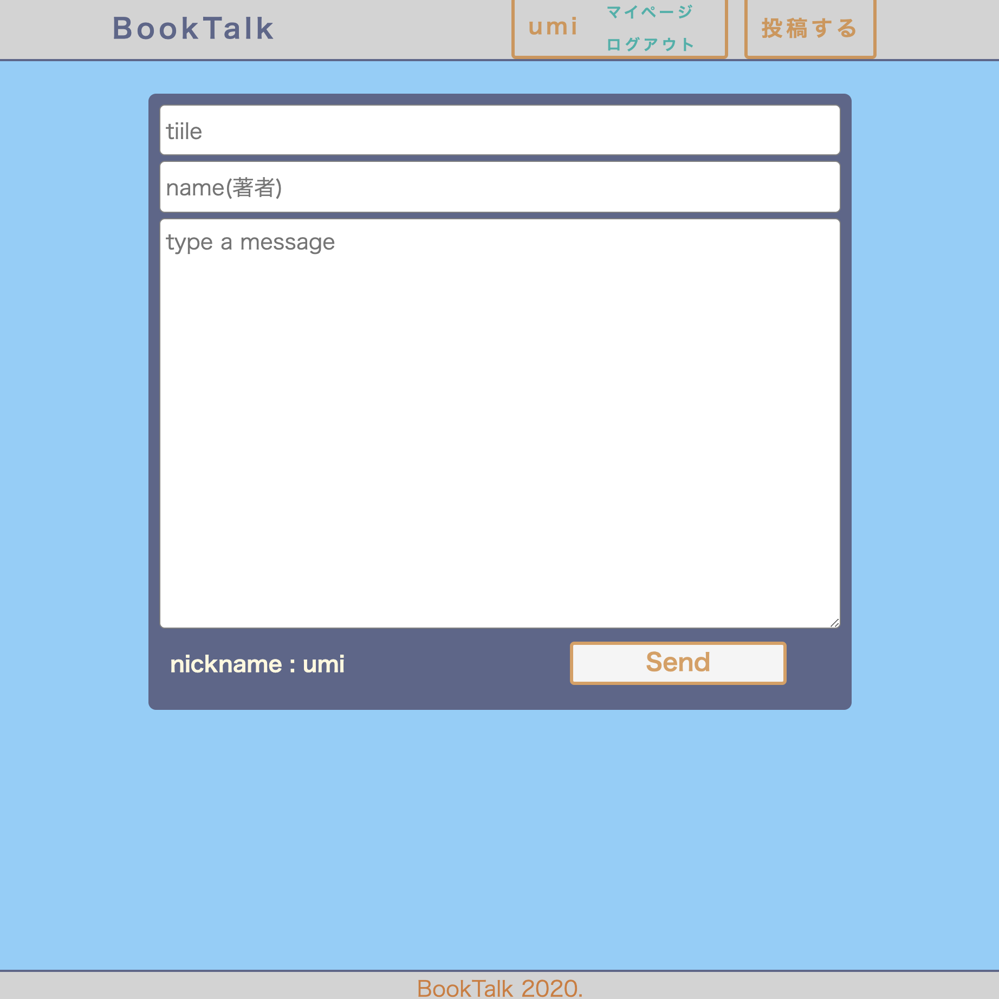

# Book Talk
### 読書をインプットしたままにしない、本専用のアウトプットツール！

  

# 概要

### 読書したことをアウトプットすることで、定着につなげて人生を豊かにする！

読書でのインプットを読んだままにしないための本専用アウトプットツールです。    
読書で気になった箇所や重要な箇所をメモのように残しておくことができます。  
投稿したものは他人とお互いに共有でき、投稿に対してコメントを残すこともできます。  

# アプリの挙動  

  
 
# 利用方法
1.トップページから新規登録・ログインをします。  

 
  
2.右上の投稿ボタンから、アウトプットしたい本の投稿を行ます。 
  
3.本のタイトル、著者、内容を記載し投稿します。
  
  
  
4.投稿すると、投稿一覧画面に遷移します。

5.投稿一覧から投稿詳細へ遷移することができます。  
投稿者は、自分の投稿を編集・削除ができます。
  
### 投稿一覧画面  
  
    
  
### グラフ画面  
  
    
  
# 機能一覧
|機能|概要|
|------|----|
|ユーザー管理機能|新規登録・ログイン・ログアウト|
|投稿機能|本のタイトル・著者・内容を投稿できる|
|投稿一覧機能|投稿した日記が一覧表示される|
|投稿詳細機能|投稿者は自分の投稿を削除・編集できる|
|コメント機能|投稿詳細でコメントをすることができる|
|マイページ機能|選択したユーザーの投稿のみ一覧される|
|検索機能|キーワードで投稿の検索ができる|
  
# 追加予定機能  
### 本の表紙など画像も一緒に投稿できるしたい。
  
# 開発環境
・VScode  
・Ruby 2.6.5  
・Rails 6.0.0  
・mysql2 0.5.3  
・JavaScript  

# DB設計  
## usersテーブル
|Column|Type|Options|
|------|----|-------|
|email|string|null: false|
|password|string|null: false|
|nickname|string|null: false|
### Association
- has_many :messages
- has_many :comments

## messagesテーブル
|Column|Type|Options|
|------|----|-------|
|title|string|null: false|
|name|string|null: false|
|text|text|null: false|
|nickname|string|null: false|
|user_id|integer|null: false, foreign_key: true|
### Association
- belongs_to :user
- has_many :comments

## commentsテーブル
|Column|Type|Options|
|------|----|-------|
|text|text|null: false|
|user_id|integer|null: false, foreign_key: true|
|message_id|integer|null: false, foreign_key: true|
### Association
- belongs_to :message
- belongs_to :user
